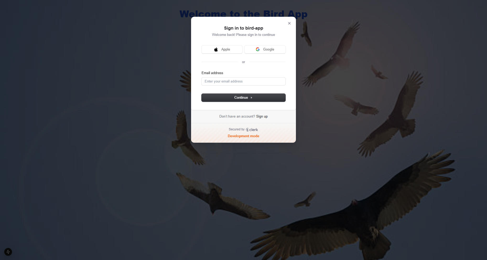

# Bird Application 🐦

A simple web application where users can log in, take photographs of birds, and log their details, including the type of bird and a nickname. The app is built using **Next.js**, **Clerk** for authentication, and the **MediaStream API** for camera access.

---

## Features

- **User Authentication**: Users can sign in and out using **Clerk**.
- **Camera Integration**: Users can activate their device's camera to capture bird photos.
- **Bird Logging**: Record the type of bird and give it a nickname.
- **State Management**: Saved bird details are stored in the app state and displayed in a responsive grid layout.
- **Styling**: A visually appealing UI using **Tailwind CSS**.

---

## Demo



---

## Prerequisites

1. Node.js (>= 14.x)
2. NPM or Yarn
3. A **Clerk** account for authentication setup.

---

## Folder Structure

.
├── public/
│   └── download.jpg     # Background image
├── src/
│   └── app/
│       └── page.tsx     # Main app component
├── .env                 # Environment variables (not committed to Git)
├── package.json         # Project metadata and dependencies
└── README.md            # This file

## Getting Started

### Clone the Repository
```bash
git clone https://github.com/Tom-dev311/Bird_app.git
cd Bird_app
